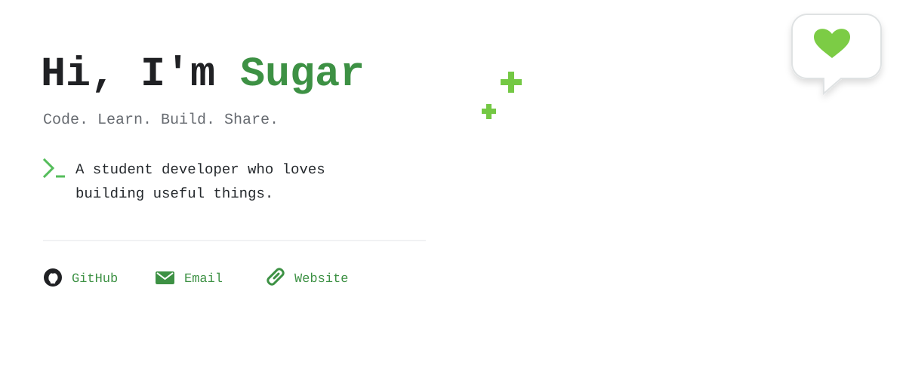

  

  
  &nbsp;
  
  &nbsp;
  

## About Me

> Passionate about full-stack development, AI, and thoughtful design.
>
> Exploring new technology and building in public.

## Tech Stack

  

## Activity

